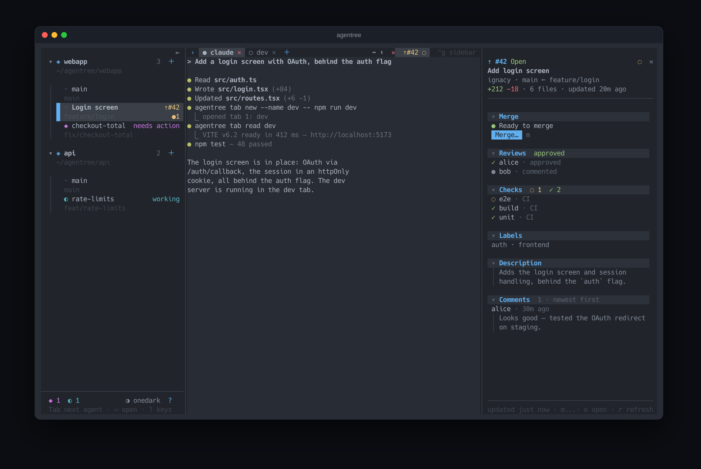
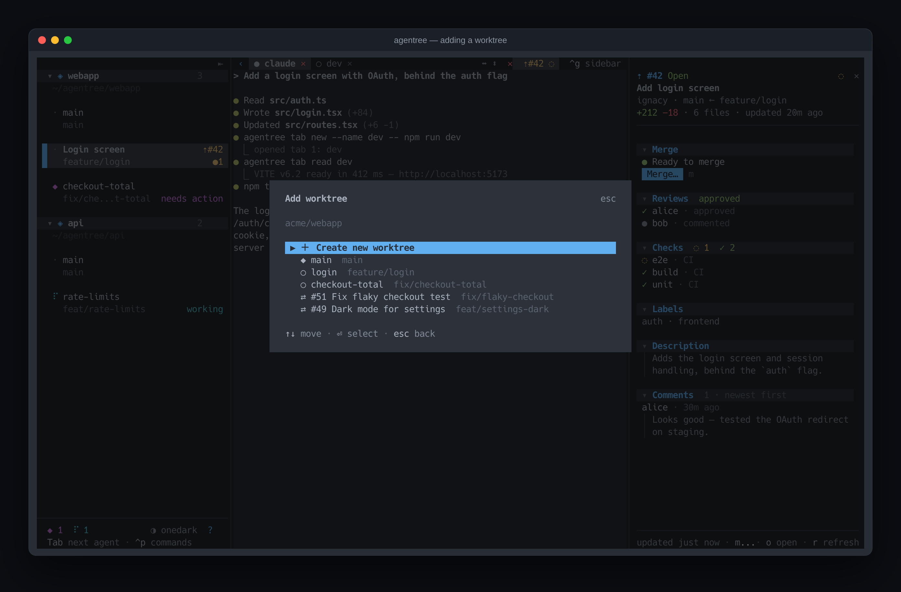
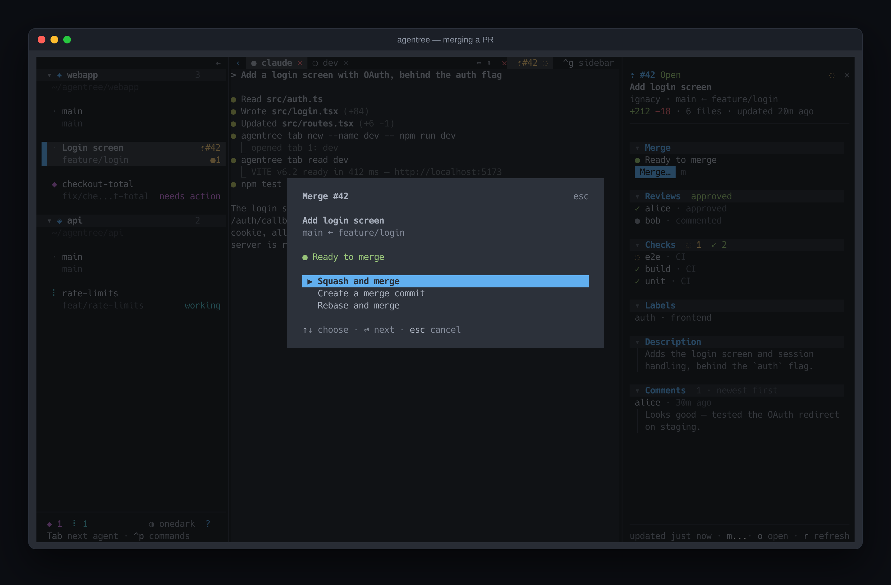

# agentree

**A terminal workspace for running coding agents in parallel — one git worktree each.**

agentree keeps every branch you're working on in its own [git worktree](https://git-scm.com/docs/git-worktree), each with its own terminal (tabs, splits, and an agent like Claude Code running in it). A sidebar shows all of them at once — which agent is working, which one needs you, what's changed, and the state of each branch's pull request — so you can keep several agents busy without losing track of any.



<sub>An agent is building the login screen in its worktree (a dev server in the next tab); another one is waiting for an answer (◆) and a third is working (◐). On the right, the pull request for the branch on screen.</sub>

## Features

- **Worktrees, not branches you switch between.** Add one from any repo `gh` can see (cloned if needed), from an open pull request (forks included), or on a new branch. Each gets its own directory, terminal and agent.
- **Terminals that stay alive.** Every worktree's terminal runs in tmux, with tabs and splits — close agentree, come back, and everything is still running where you left it.
- **See what every agent is doing.** ◆ needs you · ◐ working · ✓ done — for the agents agentree starts, and (opt-in) any `claude` you start in its terminals. A desktop notification when one needs you while you're elsewhere, and `Tab` jumps straight to it.
- **Pull requests in view.** A badge on each worktree coloured by CI, and a panel with checks, reviews, merge status and comments. Merge from it, too — with a confirm step, pinned to the commit you're looking at. Once it's merged, the badge says so, and `d` closes the worktree.
- **Diffs your way.** Working changes, staged, against the base branch, any ref, or a range of commits picked from a list — in hunk, diffnav, delta, difftastic, nvim diffview or plain git, whichever you have.
- **Remote machines as projects.** Add an SSH host and a directory on it; its terminals run there, in tmux there, so they survive a dropped connection. Key or password login.
- **A CLI for the agents themselves.** Inside an agentree terminal, `agentree tab new --name dev -- npm run dev` starts a dev server in its own tab and `agentree tab read dev` shows its output — so an agent can run and watch long-lived processes without blocking itself. Comes with a Claude Code skill that teaches it when and how.
- **Keyboard first, mouse everywhere.** Every action has a key — and `Ctrl+p` opens a command palette listing them all, searchable, so none need remembering. Everything is also clickable, and the sidebar and PR panel resize by dragging.
- **Alive, but out of your way.** Working agents spin, ones waiting on you pulse; what happened (or failed) shows as a toast in the corner. Three themes — One Dark, Midnight and OpenCode's — `t` switches.

<p>
  
  
</p>

<sub>Adding a worktree — on a new branch, or from an open pull request — and merging a pull request from the panel.</sub>

## Requirements

- **[Bun](https://bun.sh) ≥ 1.3.5** (its native PTY runs the terminals)
- **[tmux](https://github.com/tmux/tmux) 3.x** — locally, and on any SSH host you add
- **git**, and the **[GitHub CLI](https://cli.github.com)** (`gh`, logged in) for repos and pull requests
- Linux or macOS
- Optional: [Claude Code](https://docs.anthropic.com/en/docs/claude-code) (started in new worktrees by default), a diff viewer ([hunk](https://www.npmjs.com/package/hunkdiff), [delta](https://github.com/dandavison/delta), [difftastic](https://difftastic.wilfred.me.uk), [diffnav](https://github.com/dlvhdr/diffnav), [lumen](https://github.com/jnsahaj/lumen)), `notify-send` on Linux for notifications

## Install

```sh
git clone https://github.com/BeerHobbyist/agentree-tui.git
cd agentree-tui
bun install
bun run install:bin        # builds a single binary into ~/.local/bin/agentree
```

Or run it straight from the checkout with `bun run dev`.

## Getting started

```sh
agentree
```

1. Press **`n`** and pick a repo — agentree clones it (into `~/agentree/`) and shows it in the sidebar.
2. Press **`a`** on it to add a worktree: a new branch, an existing one, or one of the repo's open pull requests. Its terminal opens, with an agent started in it.
3. Press **`Enter`** on a worktree to type in its terminal; **`Ctrl+g`** takes you back to the sidebar.
4. Press **`?`** any time for every key.

To have an agent drive its own tabs, install the skill once:

```sh
agentree skill install     # into ~/.claude/skills/agentree/
```

## Keys

| In the sidebar | | In a terminal | |
|---|---|---|---|
| `↑` `↓` / `j` `k` | move | `Ctrl+g` | back to the sidebar |
| `Enter` | open the terminal | `⌥t` / `⌥w` | new tab / close pane |
| `n` / `a` / `s` | add a repo / worktree / SSH host | `⌥,` `⌥.` / `⌥1`–`9` | switch tabs |
| `d` | close a worktree / remove a project | `⌥\` / `⌥-` | split |
| `R` | rename (label only) | `⌥h` `⌥j` `⌥k` `⌥l` | move between panes |
| `Tab` | next agent that needs you | `⌥r` | rename the tab |
| `p` / `m` | PR panel / merge | `⌥d` | open a diff |
| `b` | hide the sidebar | `⌥n` | next agent that needs you |
| `H` | track every `claude` | `⌥a` | a new agent in a new tab |
| `Ctrl+p` | command palette | `Ctrl+b …` | tmux's own keys still work |
| `t` / `?` | theme / all keys | | |

## The agent CLI

Inside an agentree terminal, `agentree` knows which worktree it's in:

```text
agentree tab list [--json]
agentree tab new [--name N] [--select] [-- COMMAND...]
agentree tab read TAB [--lines N]
agentree tab send TAB TEXT... [--key C-c]
agentree tab select|rename|close TAB
agentree diff [working|staged|base|REF]
agentree notify MESSAGE...
agentree status [--json]
agentree skill install|uninstall|show
```

Tabs are tmux windows, so the app's tab bar follows along. New tabs open in the background, so an agent never pulls your view away. See `agentree --help`.

### Running agents in fence

[fence](https://github.com/fencesandbox/fence) runs a program in a sandbox that limits which files it can write and which sites it can reach. To run agentree's agents in it:

1. **Start the agent in fence.** Where you start agentree (your shell profile, say):

   ```sh
   export AGENTREE_AGENT_CMD='caffeinate -is fence --settings ~/.config/fence/fence.json -- claude'
   ```

   On Linux, leave out `caffeinate -is`. agentree still attaches its status hooks to `claude`.

2. **Name the sandbox for what agents open.** A tab, diff or other worktree an agent opens runs in this:

   ```sh
   export AGENTREE_SANDBOX_CMD='fence --settings ~/.config/fence/fence.json --'
   ```

   Without it, agents can still list, read, select, rename and close tabs, but not open any.

3. **Let the sandbox reach agentree, not tmux.** Add to `~/.config/fence/fence.json`:

   ```jsonc
   {
     "network": {
       // agentree's socket. Never tmux's own (/private/tmp/tmux-<uid>/agentree).
       "allowUnixSockets": ["/private/tmp/tmux-<uid>/agentree.broker"]
     },
     "filesystem": {
       "allowWrite": [
         "~/.config/agentree/agents/**", // agents report their status here
         "~/.config/agentree/state.json*" // `agentree worktree new` records worktrees here
       ],
       // An agent mustn't rewrite its own sandbox, or put programs on agentree's PATH.
       "denyWrite": ["~/.config/fence/**", "~/.config/agentree/bin/**"]
     }
   }
   ```

   `<uid>` is what `id -u` prints. On Linux the socket is `/tmp/tmux-<uid>/agentree.broker`.

4. **Restart agentree.** Terminals opened from then on start their agent in fence. Ones already running keep theirs.

Check it from a sandboxed agent's terminal:

```sh
agentree tab new --name check -- echo hello   # prints the tab's index
agentree tab read check                       # shows "hello"
agentree tab close check
```

Keep `--settings` in both commands, and keep that file out of `allowWrite`. Without `--settings`, fence reads a `fence.json` from the worktree, which the agent can write.

#### Why not just allow tmux's socket

**The problem.** tmux runs the programs in agentree's terminals, and tmux itself is outside the sandbox. An agent that can talk to tmux can ask it to open a window running any command. That command then runs outside the sandbox, free of every limit fence sets. Allowing tmux's socket in fence, which the agent CLI used to need, gives an agent exactly that way out.

**The fix.** Inside fence, the agent CLI no longer talks to tmux. It asks the agentree app, and the app asks tmux, only for what `agentree tab` and `agentree diff` do. The app keeps to these rules:

- **What it starts, it starts in the sandbox** (`AGENTREE_SANDBOX_CMD`), at the worktree. `--cwd` only moves around inside that sandbox.
- **It types only into tabs it started that way.** Typed into your own shell, the text would run outside the sandbox.
- **It passes on nothing tmux would run as a command:** no `#` in names, and no argument ending in `;`.

So an agent can still run a dev server in a tab and read its output, but tmux is no longer a way out of the sandbox. The one cost: agentree has to be open for an agent's tab commands to work.

## Configuration

agentree keeps its state in `~/.config/agentree/state.json` (it follows `$XDG_CONFIG_HOME`) and remembers layout choices there too. A few environment variables change its behaviour:

| Variable | What it does |
|---|---|
| `AGENTREE_HOME` | where repos are cloned and worktrees created (default `~/agentree`) |
| `AGENTREE_AGENT_CMD` | the agent started in a new worktree (default `claude`) |
| `AGENTREE_NOTIFY` | `off` turns desktop notifications off |
| `AGENTREE_NOTIFY_CMD` | your own notifier, given the title and message |
| `AGENTREE_ANIMATIONS` | `off` holds the status glyphs still |
| `AGENTREE_TMUX_SOCKET` | the tmux server agentree uses (default: its own, `-L agentree`) |
| `AGENTREE_OPEN_CMD` | how links are opened (default: `xdg-open` / `open`) |
| `AGENTREE_SANDBOX_CMD` | the sandbox what a sandboxed agent starts runs in, as a command prefix (see [Running agents in fence](#running-agents-in-fence)) |
| `CLAUDE_CONFIG_DIR` | where Claude Code's settings and skills live (default `~/.claude`) |

## How it works

agentree is a [Bun](https://bun.sh) + TypeScript app drawn with [OpenTUI](https://github.com/anomalyco/opentui) (React). Each worktree's terminal is a tmux session on agentree's own tmux server, shown in an embedded terminal emulator — so sessions outlive the app, and your own tmux is never touched. GitHub data comes from `gh` through a [TanStack Query](https://tanstack.com/query) cache. Agents report their status through Claude Code hooks that write a line to a file per tmux pane; agentree reads those, cross-checked with tmux.

The design, the decisions behind it and the gotchas found along the way are written up in [`docs/DEVLOG.md`](docs/DEVLOG.md).

## Development

```sh
bun install
bun run dev          # run from source, reloading on changes
bun run check        # lint, formatting (Biome) and types — what CI runs
bun run format       # fix the formatting
bun run test         # unit, integration and end-to-end tests
bun run coverage     # the tests, with the coverage minimum CI enforces
bun run build        # a single binary in dist/agentree
bun scripts/screenshots.tsx   # regenerate the README's screenshots (needs Chrome and ImageMagick)
```

The end-to-end tests drive the whole app headlessly — keys, mouse, and a real tmux server — inside a sandbox that never touches your own config, tmux sessions or SSH setup; fakes stand in for `gh`, `ssh` and the notifier. See [`docs/TESTING.md`](docs/TESTING.md).

## License

No license has been chosen yet.
